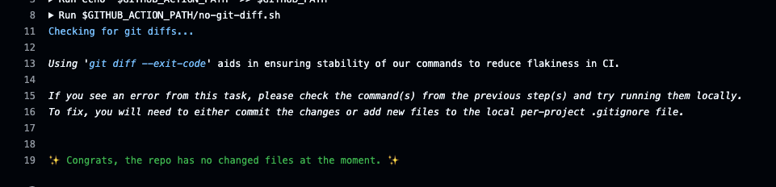
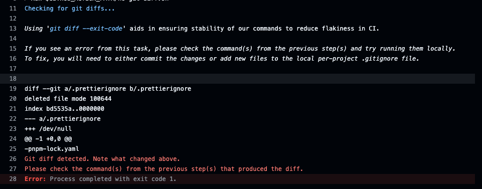

# `wyvox/action-no-git-diff`

Checks the repo for a git diff, and errors if there is a diff.

Usage:

```yml
steps:
  # ...
  - run: ./my-action/that-might-cause-a/diff
  - uses: wyvox/action-no-git-diff@1
```

An example command that might cause a diff would be a monorepo build, via turbo, nx, moonrepo, rollup, vite, or some other tool.

This action is to help reduce flakiness and aid in the pursuit of stability in CI.

## When things go right



<details><summary>text</summary>

Checking for git diffs...

Using 'git diff --exit-code' aids in ensuring stability of our commands to reduce flakiness in CI.

If you see an error from this task, please check the command(s) from the previous step(s) and try running them locally.
To fix, you will need to either commit the changes or add new files to the local per-project .gitignore file.


✨ Congrats, the repo has no changed files at the moment. ✨

</details>

## When things go wrong:



<details><summary>text</summary>

Checking for git diffs...

Using 'git diff --exit-code' aids in ensuring stability of our commands to reduce flakiness in CI.

If you see an error from this task, please check the command(s) from the previous step(s) and try running them locally.
To fix, you will need to either commit the changes or add new files to the local per-project .gitignore file.


diff --git a/.prettierignore b/.prettierignore
deleted file mode 100644
index bd5535a..0000000
--- a/.prettierignore
+++ /dev/null
@@ -1 +0,0 @@
-pnpm-lock.yaml
Git diff detected. Note what changed above.
Please check the command(s) from the previous step(s) that produced the diff.
Error: Process completed with exit code 1.

</details>
